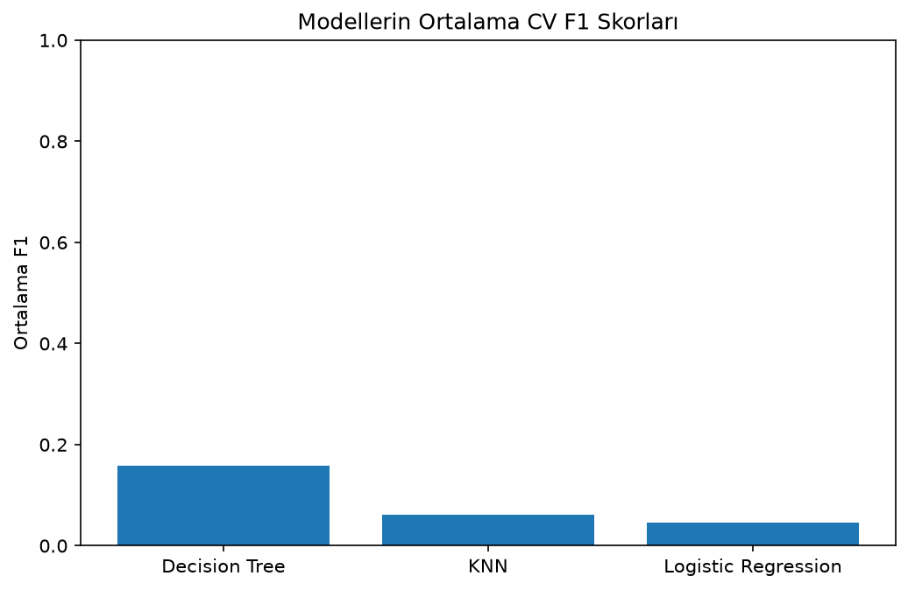

# Diyabet Hastalarında 30 Gün İçinde Tekrar Yatış Tahmini

Geçmiş hastane kayıtları üzerinde hazırlanmış, öğrenme amaçlı bir ikili sınıflandırma projesidir. Logistic Regression, KNN ve Decision Tree karşılaştırılmış; hasta bazlı doğrulama, parametre araması ve karar eşiği denemeleri yapılmıştır.

**Temel sonuç:** Logistic Regression'ın karar eşiğini doğrulama sonuçlarına göre 0.50'den 0.10'a indirmek, testte recall değerini **%1,77'den %64,44'e**, F1 skorunu **0,0339'dan 0,2501'e** yükseltmiştir. Buna karşılık precision düşmüş ve yanlış pozitif sayısı artmıştır. Bu çalışma klinik karar sistemi veya tıbbi tavsiye niteliğinde değildir.

## Problem tanımı

Amaç, bir hastane yatışına ait bilgilerden hastanın taburculuk sonrası 30 günden kısa sürede tekrar yatış yapıp yapmayacağını tahmin etmektir. Her satır bir hastane karşılaşmasını/yatış kaydını temsil eder; aynı hastanın birden fazla kaydı bulunabilir.

## Dataset

- Kaynak: [UCI Diabetes 130-US Hospitals for Years 1999–2008](https://archive.ics.uci.edu/dataset/296/diabetes+130-us+hospitals+for+years+1999-2008)
- Atıf: Clore, Cios, DeShazo ve Strack (2014), UCI Machine Learning Repository. [DOI: 10.24432/C5230J](https://doi.org/10.24432/C5230J).
- 1999–2008 dönemindeki 130 ABD hastanesinden kayıtlar.
- 101.766 satır, hedef dönüşümü öncesinde 50 sütun ve 71.518 farklı hasta.
- Pozitif sınıf: 11.357 kayıt (%11,16). Sınıflar dengesizdir.

## Target tanımı

`readmitted` sütunundan `readmitted_30` oluşturulmuştur:

| Kaynak değer | Yeni hedef | Anlamı |
|---|---:|---|
| `<30` | 1 | 30 günden kısa sürede tekrar yatış |
| `>30` | 0 | 30 günden sonra tekrar yatış |
| `NO` | 0 | Tekrar yatış kaydı yok |

Pozitif sınıf `1`'dir. Bu dönüşüm, veri setindeki etiketleri kullanır; sıfır sınıfı hastanın gelecekte hiç tekrar yatmayacağı anlamına gelmez.

## Veri ön işleme

- `?` değerleri eksik kabul edilmiştir. `keep_default_na=False` ile `None` gibi metin kategorileri korunmuştur. `max_glu_serum` ve `A1Cresult` içindeki `None`, ilgili testin yapılmadığını ifade eder.
- `encounter_id` ve `patient_nbr` tanımlayıcı oldukları için model girdilerine alınmamıştır. `patient_nbr`, hastaları ayırmak için ayrıca kullanılmıştır.
- Yaklaşık %97'si eksik olan `weight` çıkarılmıştır. Hedefi içeren `readmitted` ve `readmitted_30` da girdilerden çıkarılarak hedef sızıntısı önlenmiştir.
- Sekiz sayısal sütuna `StandardScaler` uygulanmıştır. Bu sütunlarda eksik değer bulunmadığından sayısal doldurma yapılmamıştır.
- Kalan 38 sütun kategorik olarak işlenmiştir. Sayıyla ifade edilen yatış türü, taburculuk durumu ve yatış kaynağı kodları da bu gruptadır.
- Kategorik eksikler `SimpleImputer(strategy="most_frequent")` ile doldurulmuş, kategoriler `OneHotEncoder(handle_unknown="ignore")` ile kodlanmıştır.
- Sayısal ve kategorik sonuçlar `hstack` ile seyrek matris olarak birleştirilmiştir.

`prepare_features` fonksiyonu, imputer, encoder ve scaler'ı yalnızca kendisine verilen eğitim bölümünde öğrenir. Aynı dönüşümleri değerlendirme bölümüne uygular. Bu işlem her doğrulama bölmesinde yeniden yapılır.

## Eğitim ve doğrulama düzeni

İlk ayrım `GroupShuffleSplit(test_size=0.20, random_state=42)` ile hasta bazında yapılmıştır:

| Bölüm | Kayıt sayısı | Hasta sayısı |
|---|---:|---:|
| Eğitim | 81.613 | 57.214 |
| Test | 20.153 | 14.304 |

İki bölümde ortak hasta yoktur. %20 oranı hasta gruplarına uygulanır; kayıtların tam %20'si olmak zorunda değildir.

Eğitim verisi içinde `GroupShuffleSplit(n_splits=3, test_size=0.20, random_state=42)` ile üç tekrarlı hasta bazlı doğrulama yapılmıştır. Bunlar üç ayrık K-Fold parçası değildir; farklı tekrarların doğrulama kayıtları örtüşebilir. Modeller aynı bölmelerde karşılaştırılmıştır. Kodda `X_fold_test` adı verilen bölüm, ana test kümesi değil, eğitim içinden ayrılan doğrulama bölümüdür.

## Kullanılan modeller ve parametre araması

| Model | Başlangıç ayarları |
|---|---|
| Logistic Regression | `max_iter=1000` |
| KNN | `n_neighbors=5` |
| Decision Tree | `random_state=42`, diğer ayarlar varsayılan |

Decision Tree için `max_depth=[5, 10, None]` ve `min_samples_leaf=[1, 10]` denenmiştir. Altı kombinasyonun her biri üç doğrulama bölmesinde değerlendirilmiştir. Bu arama döngülerle gerçekleştirilmiştir; `GridSearchCV` sınıfı kullanılmamıştır.

En yüksek ortalama F1, `max_depth=None` ve `min_samples_leaf=1` ile elde edilmiştir. Bunlar başlangıç ayarlarıyla aynıdır; bu parametre araması iyileşme sağlamamıştır.

## Değerlendirme metrikleri

- **Accuracy:** Tüm doğru tahminlerin oranı. Sınıf dengesizliği nedeniyle tek başına yeterli değildir. Testte herkese `0` demek bile yaklaşık %89,33 accuracy verir; ancak recall sıfır olur.
- **Precision:** Pozitif tahminlerin ne kadarının gerçekten pozitif olduğu.
- **Recall:** Gerçek pozitif kayıtların ne kadarının yakalandığı.
- **F1:** Precision ve recall'un harmonik ortalaması; model/eşik seçiminde öncelikli ölçüt olarak kullanılmıştır.
- **Confusion matrix:** TN, FP, FN ve TP sayılarını gösterir. FN, gerçekte kısa sürede tekrar yatış olan bir kaydın `0` tahmin edilmesidir; FP ise gerçekte `0` olan kaydın `1` tahmin edilmesidir.

## Model karşılaştırması

Aşağıdakiler üç doğrulama bölmesinin aritmetik ortalamalarıdır:

| Başlangıç modeli | Accuracy | Precision | Recall | F1 |
|---|---:|---:|---:|---:|
| Logistic Regression | %88,64 | %49,19 | %2,38 | 0,0452 |
| KNN | %87,71 | %23,07 | %3,58 | 0,0619 |
| Decision Tree | %81,86 | %16,78 | %15,08 | 0,1589 |



Bu grafik başlangıç modellerini gösterir; aşağıdaki eşik değişikliğini içermez.

### Karar eşiği denemesi

Logistic Regression'ın pozitif sınıf olasılıklarına dört eşik uygulanmıştır. Aynı doğrulama bölmelerindeki ortalama sonuçlar:

| Eşik | Precision | Recall | F1 |
|---|---:|---:|---:|
| **0.10** | **%16,28** | **%63,24** | **0,2590** |
| 0.20 | %25,09 | %23,16 | 0,2408 |
| 0.30 | %33,09 | %9,87 | 0,1519 |
| 0.50 | %49,19 | %2,38 | 0,0452 |

Denenen seçenekler arasında en yüksek ortalama F1'i verdiği için **Logistic Regression ve 0.10 eşiği** seçilmiştir. Bu seçim tüm hataların azaldığı anlamına gelmez: eşik düştükçe daha fazla pozitif yakalanırken yanlış alarmlar da artmıştır.

## Final sonuç

Tüm eğitim verisiyle eğitilmiş Logistic Regression'a, doğrulamada seçilen sabit 0.10 eşiği uygulanmıştır. Test sonuçları:

| Ölçüm | Başlangıç eşiği: 0.50 | Seçilen eşik: 0.10 |
|---|---:|---:|
| Accuracy | %89,27 | %58,76 |
| Precision | %43,18 | %15,52 |
| Recall | %1,77 | %64,44 |
| F1 | 0,0339 | 0,2501 |
| TN | 17.952 | 10.455 |
| FP | 50 | 7.547 |
| FN | 2.113 | 765 |
| TP | 38 | 1.386 |

2.151 gerçek pozitif kaydın 1.386'sı yakalanmıştır. Kaçırılan pozitif sayısı 2.113'ten 765'e düşmüş, ancak yanlış pozitif sayısı 50'den 7.547'ye yükselmiştir. Pozitif tahminlerin yalnızca %15,52'sinin doğru olması, modelin önemli bir sınırlamasıdır. Eşik değişimi recall ve F1'i iyileştirmiştir; genel hata sayısını azaltmamıştır.

## Projenin sınırlamaları

- Veri 1999–2008 dönemine aittir; sonuçlar günümüz hastanelerine veya farklı hasta gruplarına doğrudan genellenemez.
- Bu bir klinik karar sistemi değildir. Çıktılar tıbbi tavsiye ya da gerçek hasta kararları için kullanılmamalıdır.
- **Test sonuçları geliştirme sürecinde daha önce incelenmiştir.** Bu nedenle son tablo tamamen dokunulmamış, bağımsız bir final test değerlendirmesi olarak sunulamaz. Karar eşiği doğrulama sonuçlarından seçilmiş ve son testten sonra değiştirilmemiştir.
- Yalnızca üç tekrarlı doğrulama yapılmıştır. Model ve eşik seçimi aynı doğrulama bölmelerine dayandığı için seçilen en yüksek doğrulama skoru iyimser olabilir; sonuçlar kesin bir genelleme başarısı göstermez.
- Sınıf dengesizliği vardır. Yeniden örnekleme veya sınıf ağırlığı kullanılmamıştır. Parametre ve eşik araması sınırlıdır.
- Son modelin precision değeri düşüktür ve çok sayıda yanlış alarm üretir. Hasta bazlı ayrım yapılmış olsa da zamana göre veya farklı hastanelerde bağımsız doğrulama yapılmamıştır.

## Çalıştırma

Kullanılan ortam: **Python 3.13.1**. `requirements.txt`, projenin çalıştırıldığı ortamdaki beş temel kütüphanenin sürümlerini sabitler.

1. UCI sayfasından veri setini indirip `diabetic_data.csv` dosyasını `data` klasörüne yerleştirin. `IDs_mapping.csv`, kaynak kodların açıklamalarını incelemek için kullanılabilir; eğitim kodu tarafından okunmaz.
2. Gerekli kütüphaneleri kurun:

   ```bash
   python -m pip install -r requirements.txt
   ```

3. Veri dosyasının `main.py` ile aynı proje klasöründeki `data/diabetic_data.csv` konumunda bulunduğunu kontrol edin. Kod, dosya yolunu proje klasörüne göre bulur; kullanıcıya özel yol yazmanız gerekmez.
4. Proje klasöründe çalıştırın:

   ```bash
   python main.py
   ```

Kod bütün modelleri ve deneyleri yeniden çalıştırır; özellikle KNN işlemleri zaman alabilir. Sonuçlar terminale basılmak yerine `results` klasörüne kaydedilir. Çalışma bir eğitim/değerlendirme betiğidir; yeni kayıtlar için dağıtıma hazır bir uygulama veya kaydedilmiş model sunmaz.

## Dosya düzeni

```text
diabetes-readmission/
├── main.py
├── README.md
├── requirements.txt
├── .gitignore
├── data/
│   ├── diabetic_data.csv
│   └── IDs_mapping.csv
└── results/
    ├── model_comparison.csv
    ├── cv_model_summary.csv
    ├── cv_f1_comparison.png
    ├── logistic_regression_cv.csv
    ├── knn_cv.csv
    ├── decision_tree_cv.csv
    ├── decision_tree_grid_search_cv.csv
    ├── decision_tree_grid_summary.csv
    ├── logistic_regression_threshold_cv.csv
    ├── logistic_regression_threshold_summary.csv
    └── selected_model_test_results.csv
```

`main.py` ana çalışma dosyasıdır. CSV dosyaları deneylerin ayrıntılarını ve özetlerini korur; `selected_model_test_results.csv` seçilen yaklaşımın son test ölçümlerini içerir.

Ham veri CSV dosyaları `.gitignore` ile Git dışında tutulur; yerel dosyalar silinmez. Veriyi UCI kaynağından indirerek `data` klasörüne koyun. Deney sonuçları ve grafikler GitHub deposunda tutulur.
